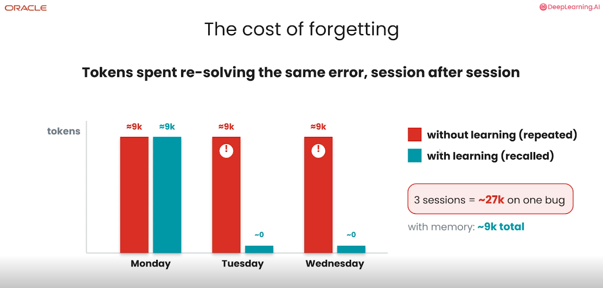
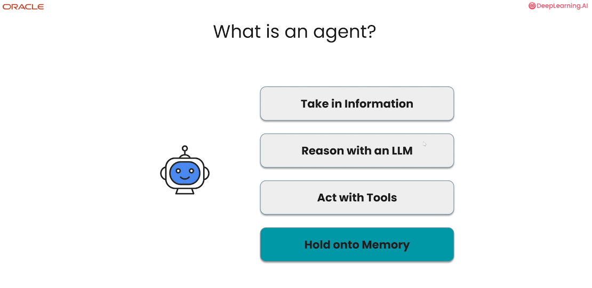
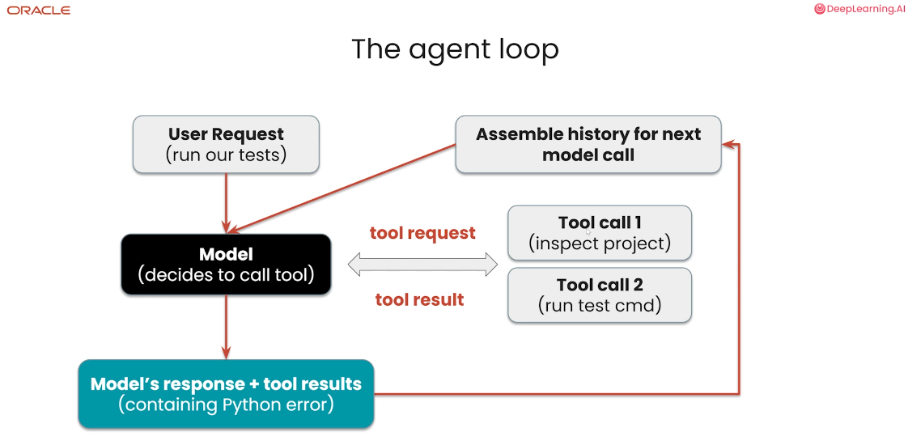
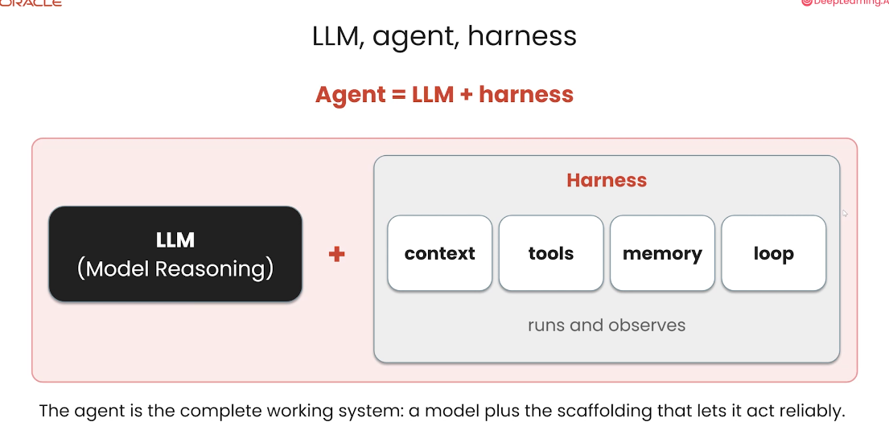
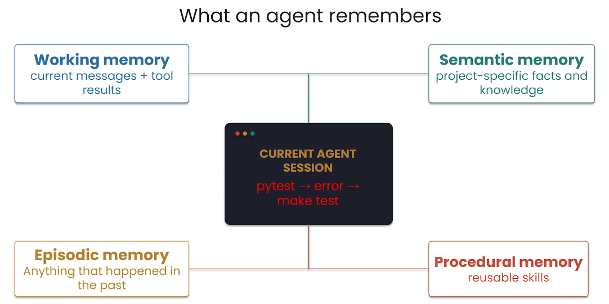
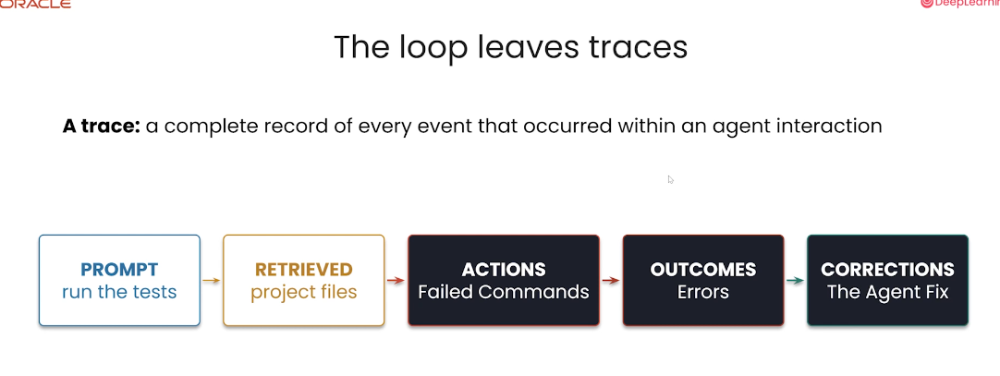
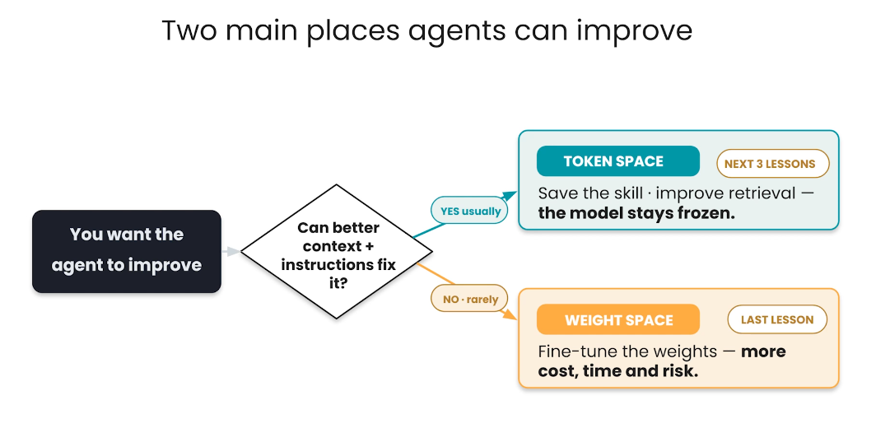

# 1. Agents, mémoire et traces

Un agent utile ne se contente pas de produire une réponse : il observe, choisit une action, utilise des outils et apprend de ce qui s’est passé. La mémoire et les traces rendent ce cycle cumulatif au lieu de le faire repartir de zéro à chaque session.

## Objectifs du chapitre

- décrire la boucle agentique et le rôle du `harness` ;
- distinguer les quatre formes de mémoire ;
- comprendre ce qu’une trace conserve ;
- différencier les adaptations dans le `token space` et le `weight space`.

## Le coût de l’oubli

Un agent rencontre un problème le lundi et dépense environ **9 000 tokens** pour l’étudier et le résoudre. Un token est une petite unité de texte traitée par le modèle ; il peut correspondre à un mot, à une partie de mot ou à un signe de ponctuation.

Sans mémoire, l’agent recommence pratiquement la même investigation le mardi et le mercredi. Le coût atteint alors environ **27 000 tokens** pour le même problème. Avec une mémoire exploitable, la solution du lundi est récupérée et réutilisée : le coût reste proche de **9 000 tokens** au total dans l’exemple.

La mémoire ne rend pas l’agent infaillible. Elle évite surtout de payer plusieurs fois pour une information déjà découverte.



## Qu’est-ce qu’un agent ?

Un agent est un système qui :

1. reçoit des informations de l’utilisateur ou de son environnement ;
2. raisonne avec un **LLM** (*Large Language Model*, grand modèle de langage) ;
3. agit à l’aide d’outils ;
4. conserve éventuellement des informations utiles pour les interactions suivantes.

Un outil est une fonction externe au modèle : lire un fichier, lancer un test, exécuter une commande ou interroger une base de données. Le LLM décide quelle action semble pertinente, mais c’est l’environnement qui l’exécute et lui renvoie un résultat.



## La boucle agentique

L’`agent loop` est le cycle qui transforme une demande en série d’actions observables :

```text
requête utilisateur
        ↓
inférence du modèle
        ↓
demande d’outil (tool call)
        ↓
résultat de l’outil (tool result)
        ↓
historique du contexte
        ↓
nouveau raisonnement
        ↺
```

L’**inférence** est le moment où le modèle traite son contexte pour produire une décision. Un **tool call** est une demande d’exécution adressée à un outil ; le **tool result** est la sortie de cet outil. Chaque **itération** ajoute des informations à la **context history**, l’historique fourni au modèle lors du raisonnement suivant. La boucle s’arrête quand la tâche est terminée ou que l’agent décide de ne plus agir.



## LLM, harness et agent

La formule du cours est :

```text
Agent = LLM + harness
```

Le LLM apporte la capacité de raisonnement et de génération. Le **harness** est l’infrastructure qui l’entoure : il assemble le contexte, expose les outils, lance leurs appels, conserve les résultats, gère la mémoire et rappelle le modèle après chaque observation.

Cette distinction est importante. Un modèle seul ne peut pas lire un dépôt ou modifier un fichier. Le harness relie son raisonnement à un environnement contrôlable et rend la boucle répétable.



## Les quatre types de mémoire

| Type | Contenu | Exemple |
|---|---|---|
| **Working memory** | Informations temporaires de la session courante | Messages récents, résultats d’outils et hypothèses en cours |
| **Episodic memory** | Souvenirs d’expériences passées | Une erreur rencontrée et la correction qui a fonctionné |
| **Semantic memory** | Faits et connaissances stables | Structure d’un projet ou commande de test officielle |
| **Procedural memory** | Méthodes et procédures réutilisables | « Lire le Makefile puis lancer `make test` » |

La working memory sert au raisonnement immédiat. Les trois autres formes permettent de réutiliser respectivement des épisodes, des faits et des savoir-faire.



## Les traces

Une **trace** est l’enregistrement complet d’une interaction avec l’agent. Elle ne conserve pas seulement la réponse finale, mais le chemin suivi :

- `prompt` : demande initiale ;
- `retrieved` : informations récupérées ;
- `actions` : commandes et appels d’outils ;
- `outcomes` : résultats, erreurs ou succès ;
- `corrections` : ajustements effectués après observation.

Cette granularité transforme les échecs en données utiles. Plusieurs traces peuvent révéler qu’une procédure manque une étape, qu’un outil est mal choisi ou qu’une solution fiable revient régulièrement. Elles deviennent alors la matière première de la mémoire procédurale et de la `skill induction`.



## Deux espaces d’adaptation

Le premier réflexe consiste généralement à améliorer ce que le modèle reçoit dans le **token space** : contexte, instructions, mémoire, exemples, compétences et retrieval. Le modèle reste inchangé ; on améliore la sélection et l’organisation des informations présentes dans son contexte.

Le **weight space** désigne les paramètres internes du modèle. Le fine-tuning les modifie pour influencer durablement le comportement. Cette voie demande davantage de données, de calcul et de contrôle, avec un risque plus élevé d’interférer avec les capacités existantes.

Commencer par le token space est donc une stratégie de prudence : elle est souvent moins coûteuse, plus réversible et suffisante pour corriger un problème de contexte ou de procédure.



## À retenir

- Un agent combine un modèle de langage, des outils, une boucle de décision et éventuellement une mémoire.
- La boucle agentique alterne raisonnement, appels d’outils et observation des résultats.
- Le harness fournit l’infrastructure qui transforme un LLM en système capable d’agir.
- Working, episodic, semantic et procedural memory répondent à des besoins différents.
- Une trace conserve aussi les erreurs et les corrections, pas seulement le résultat final.
- L’adaptation du contexte est généralement le premier levier ; modifier les poids vient ensuite.

[← Retour au README](../README.md)
