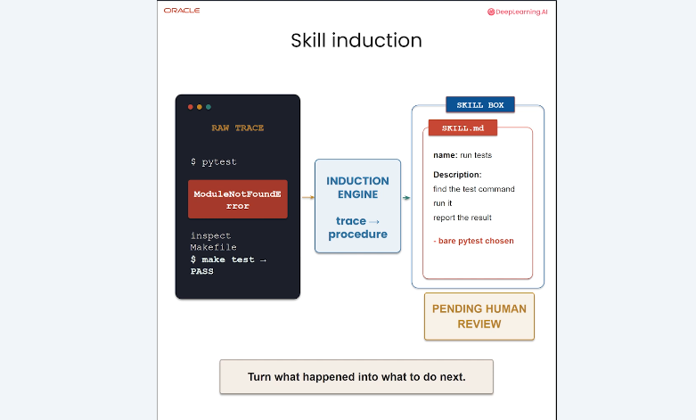
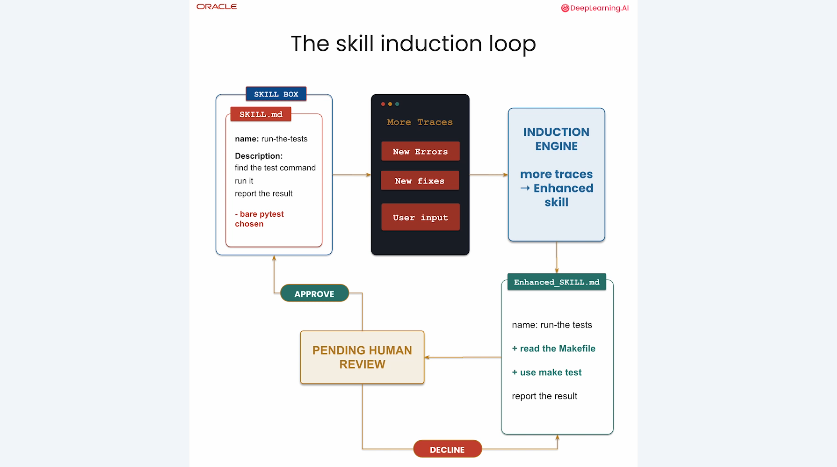
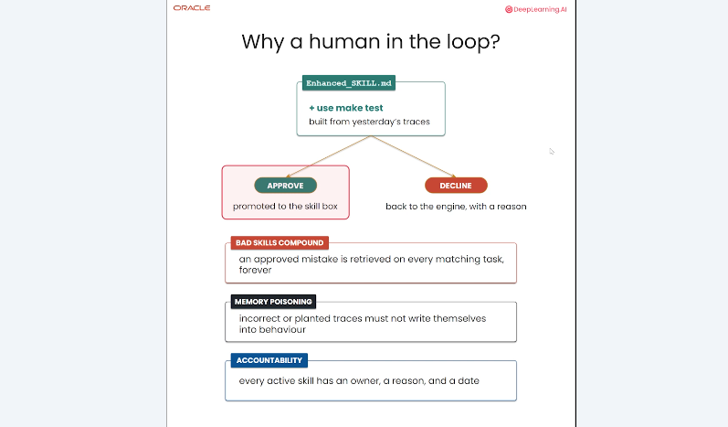

# 2. Skill induction : transformer l’expérience en compétence

Une trace décrit un épisode particulier. Une **skill** en extrait une méthode qui pourra être appliquée à d’autres épisodes. La `skill induction` organise cette transformation tout en laissant à une personne la décision d’activer ou non la nouvelle procédure.

## Objectifs du chapitre

- distinguer trace, compétence et procédure ;
- comprendre le pipeline d’induction ;
- expliquer la boucle d’amélioration d’une skill ;
- justifier la validation humaine.

## De la trace brute à une compétence

Le pipeline est le suivant :

```text
Raw trace → Induction Engine → skill.md → human review → Skill Box
```

Une **raw trace** est une trace brute : commandes, erreurs, observations et correction finale. L’**Induction Engine** analyse plusieurs éléments de cette trace avec un LLM afin de dégager une procédure générale. Une procédure décrit des étapes ordonnées, des préconditions et éventuellement les erreurs à surveiller.

Le résultat est enregistré dans un fichier `skill.md`, puis soumis à une revue. Une skill approuvée rejoint la **Skill Box**, collection organisée des compétences disponibles pour le futur retrieval.

Exemple : l’agent lance `pytest`, obtient `ModuleNotFoundError`, inspecte le `Makefile`, découvre la commande officielle `make test` et obtient le succès. La skill ne mémorise pas seulement « cette commande a marché » ; elle peut devenir : vérifier d’abord les commandes documentées par le projet avant de lancer directement le framework de test.



## La boucle d’induction

Une compétence n’est pas figée. La Skill Box fournit une skill existante, puis les nouvelles exécutions produisent de nouvelles traces. Les erreurs et corrections peuvent conduire l’Induction Engine à proposer une **enhanced skill**, c’est-à-dire une version enrichie.

```text
skill existante + nouvelles traces
              ↓
       proposition améliorée
              ↓
        human review
          ↙       ↘
      approve    decline + raison
```

Un `approve` remplace ou enrichit la procédure active. Un `decline` conserve la décision et sa raison : ce retour évite de reproduire la même proposition sans changement.



## Pourquoi garder un humain dans la boucle ?

Une skill approuvée peut influencer systématiquement les futures tâches. Une erreur validée par automatisme peut donc se multiplier : les **bad skills compound**. Une trace peut aussi contenir une information fausse ou injectée volontairement ; sa transformation en mémoire constitue un risque de **memory poisoning**, c’est-à-dire l’empoisonnement d’une mémoire par des données incorrectes ou malveillantes.

Le **human-in-the-loop** désigne l’intervention d’une personne dans une étape de décision. Ici, elle vérifie que la procédure est exacte, applicable dans le bon contexte et suffisamment sûre. La décision doit être accompagnée d’une trace d’audit : qui a approuvé ou refusé, pourquoi et quand. Cette responsabilité explicite est l’**accountability**.



## De l’expérience au comportement réutilisable

Le mécanisme complet forme une chaîne de contrôle :

1. observer une exécution réelle ;
2. conserver la trace, y compris les erreurs ;
3. généraliser une procédure plutôt qu’un résultat isolé ;
4. faire relire la procédure ;
5. publier la skill approuvée dans la Skill Box ;
6. la retrouver au début d’une tâche analogue ;
7. réévaluer la skill avec les nouvelles traces.

Cette approche sépare l’apprentissage de l’activation. L’agent peut proposer des améliorations automatiquement, mais une procédure n’acquiert une influence durable qu’après validation.

## À retenir

- La skill induction transforme des épisodes détaillés en procédures réutilisables.
- `skill.md` rend la compétence lisible, versionnable et révisable.
- Les nouvelles traces permettent d’améliorer une skill existante.
- La Skill Box centralise les procédures activées.
- Le human-in-the-loop limite la propagation des erreurs et du memory poisoning.
- L’accountability conserve la justification des décisions d’approbation ou de refus.

[← Retour au README](../README.md)
