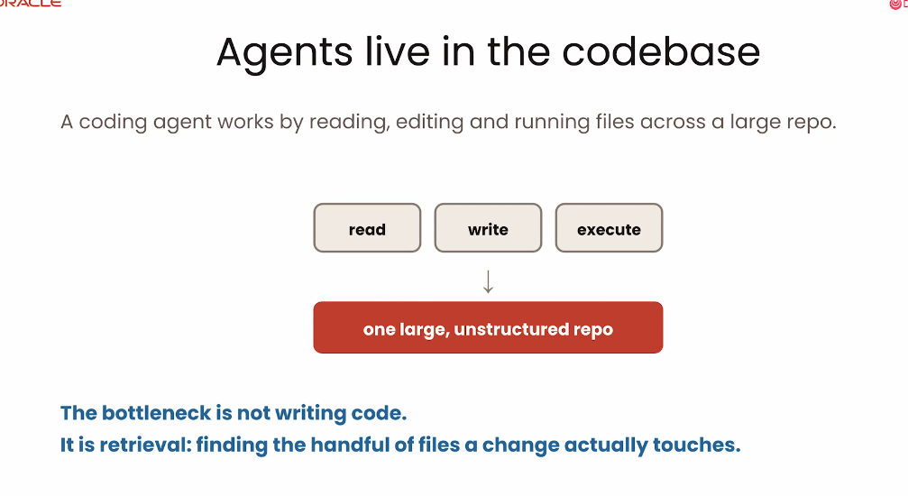
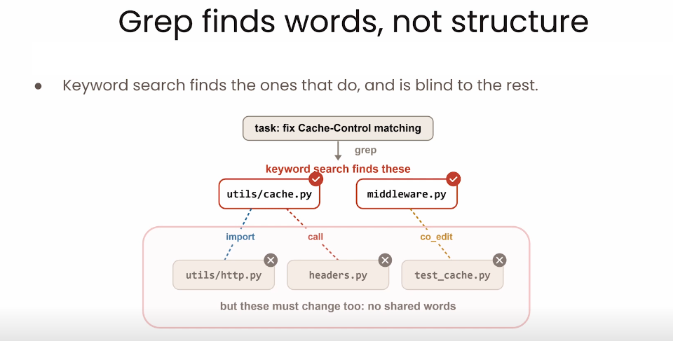
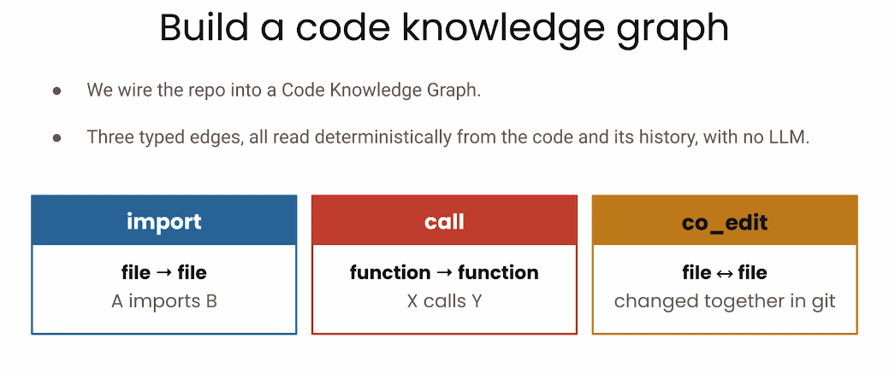
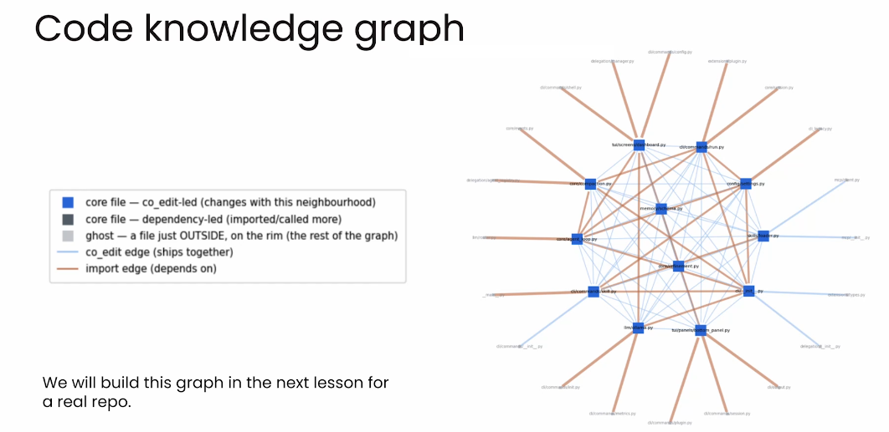
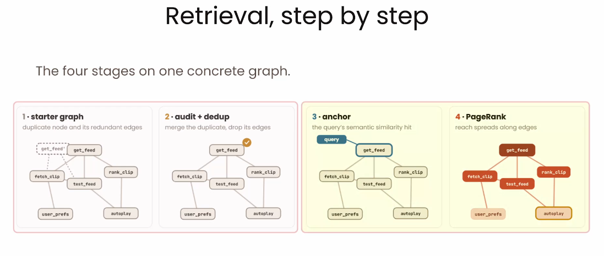
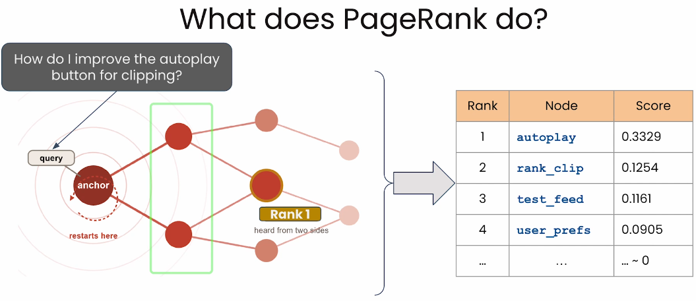
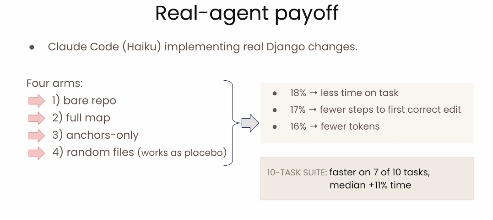
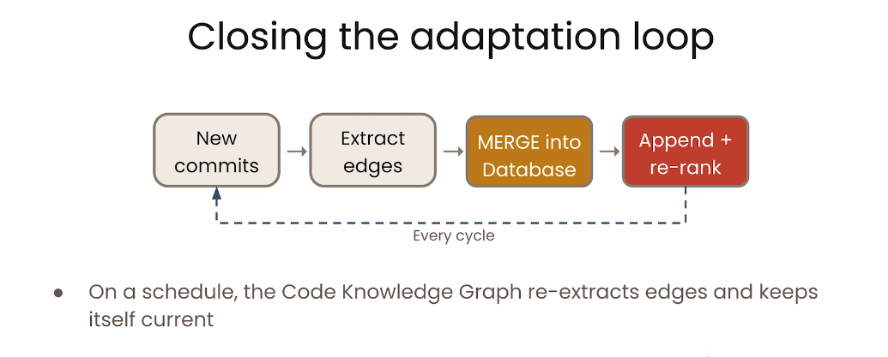

# 3. Code Knowledge Graphs : structurer la connaissance du code

Dans une grande codebase, produire du code n’est souvent pas le premier obstacle. L’agent doit d’abord retrouver les fichiers et les fonctions réellement concernés. Un **Code Knowledge Graph** rend explicites les relations que la recherche textuelle laisse invisibles.

## Objectifs du chapitre

- comprendre pourquoi le retrieval devient un bottleneck ;
- distinguer recherche lexicale et recherche structurelle ;
- identifier les relations d’un graphe de code ;
- expliquer le rôle de l’anchor et de PageRank ;
- interpréter les résultats expérimentaux avec prudence.

## Le vrai problème : retrouver les bons fichiers

Les agents lisent, écrivent et exécutent du code. Dans une petite application, quelques recherches peuvent suffire. Dans une grande **codebase** (ensemble des fichiers et ressources d’un projet), les informations sont dispersées et les dépendances difficiles à déduire.

Le **retrieval** est le processus de recherche et de récupération du contexte pertinent. Il devient le **bottleneck**, le goulot d’étranglement qui ralentit le plus la chaîne, lorsque l’agent passe plus de temps à identifier les bons fichiers qu’à écrire la modification.



## Pourquoi Grep ne suffit pas

Grep effectue une recherche textuelle : mots, motifs ou expressions régulières. Pour une demande liée à `Cache-Control`, il peut retrouver `utils/cache.py` et `middleware.py`. Mais il ne sait pas nécessairement que :

- `utils/http.py` fournit une fonction importée ;
- `headers.py` est appelé par une fonction du chemin d’exécution ;
- `test_cache.py` est fréquemment modifié avec les fichiers concernés.

Ces fichiers peuvent ne contenir aucun des mêmes mots. Une recherche par mots-clés voit le texte ; elle ne représente ni la structure d’appel ni l’historique de co-édition.



## Construire un Code Knowledge Graph

Un graphe est composé de **nodes** (nœuds) et d’**edges** (arêtes). Un node peut représenter un fichier ou une fonction. Une edge décrit une relation orientée ou non orientée entre deux nodes. On obtient ainsi un property graph lorsque les nodes et les edges portent des propriétés : type, nom, chemin ou score.

Les trois relations principales sont :

| Relation | Forme | Signification |
|---|---|---|
| `import` | fichier → fichier | Un fichier dépend d’un autre fichier importé |
| `call` | fonction → fonction | Une fonction appelle une autre fonction |
| `co-edit` | fichier ↔ fichier | Deux fichiers ont souvent été modifiés ensemble dans Git |

Les imports et les appels peuvent être extraits de manière déterministe depuis le code. Le co-edit vient de l’historique Git. Le graphe complète donc la similarité textuelle par une carte de dépendances.





## Import edges

Une relation `import` relie par exemple `autoplay.py` à `get_feed.py` et `rank_clip.py`. Elle indique que le premier fichier dépend de symboles définis dans les seconds. Les import edges donnent à l’agent un premier voisinage fiable autour d’un fichier trouvé par une requête.

Dans les langages structurés, un parseur peut construire un **AST** (*Abstract Syntax Tree*, représentation arborescente du code). L’AST permet de distinguer un véritable import ou appel d’une simple occurrence textuelle et de conserver la direction de la relation.

## Lire la structure du graphe

Les **core files** sont fortement connectés au reste du projet. Les **ghost files** se trouvent à la périphérie du groupe principal mais restent reliés à celui-ci ; ils méritent parfois d’être examinés, même s’ils ne contiennent pas les mots de la requête. Les zones centrales, les hubs et les fichiers très connectés constituent des points d’entrée utiles pour l’exploration.

## Retrieval dans le graphe

Le pipeline combine recherche sémantique et structure :

```text
starter graph → audit + dedup → anchor → PageRank → liste classée
```

La **deduplication** retire ou fusionne les doublons. La **semantic similarity** mesure la proximité de sens entre une requête et un node, même si les mots diffèrent. L’**anchor** est le node de départ retenu grâce à cette proximité. PageRank exploite ensuite les edges pour classer les nodes voisins.



## PageRank

Pour une requête, le système choisit d’abord un anchor pertinent. Le score se propage ensuite à travers les relations ; les nodes ne reçoivent pas tous le même poids. Un fichier lié par plusieurs chemins importants peut remonter devant un voisin simplement proche géométriquement.

PageRank produit ainsi une liste ordonnée plutôt qu’un rayon fixe où chaque voisin serait traité pareil. Le classement aide l’agent à concentrer son contexte sur les fichiers les plus prometteurs.



## Résultats observés avec un agent réel

Dans l’expérience présentée avec Claude Code, Haiku et des tâches du dépôt Django, quatre configurations sont comparées : dépôt nu, graphe complet, anchors seuls et fichiers aléatoires comme placebo. Le graphe complet observe environ **18 % de temps en moins**, **17 % d’étapes en moins jusqu’à la première modification correcte** et **16 % de tokens en moins**. Sur dix tâches, l’agent est plus rapide dans **7 cas sur 10**, avec une médiane d’environ **11 %** de réduction du temps.

Ces chiffres décrivent cette expérience, son dépôt et ses tâches. Ils ne garantissent pas le même gain pour toute codebase.



## Fermer la boucle d’adaptation

Le graphe peut rester synchronisé avec le projet :

```text
new commits → extract edges → MERGE into database → append + re-rank
```

Les nouveaux commits fournissent les changements. Le système extrait les nouvelles relations, les fusionne dans la base du graphe, puis ajoute les nodes et recalcule les classements. L’agent dispose ainsi d’une représentation qui évolue avec le dépôt au lieu d’une carte figée.



## À retenir

- Le retrieval peut être le vrai bottleneck d’un agent de programmation.
- Grep trouve des mots, mais pas les dépendances, appels et co-éditions.
- Un Code Knowledge Graph relie fichiers et fonctions par plusieurs types d’edges.
- La similarité sémantique choisit l’anchor ; PageRank classe le voisinage structurel.
- Les gains observés dans le cours dépendent du dépôt, du modèle et des tâches.
- L’extraction incrémentale permet de maintenir le graphe au fil des commits.

[← Retour au README](../README.md)
