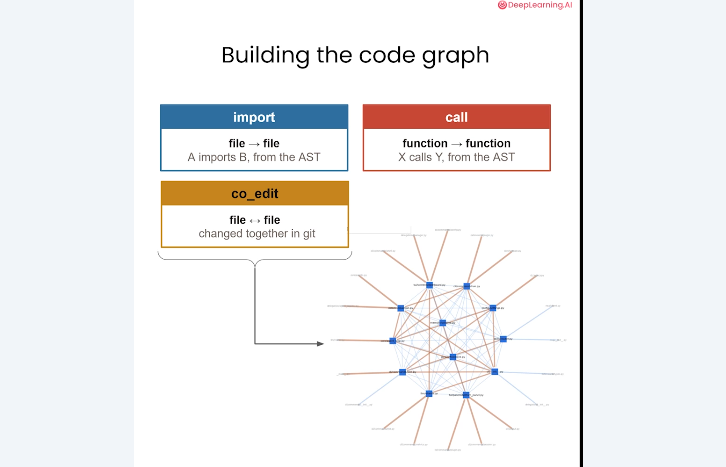
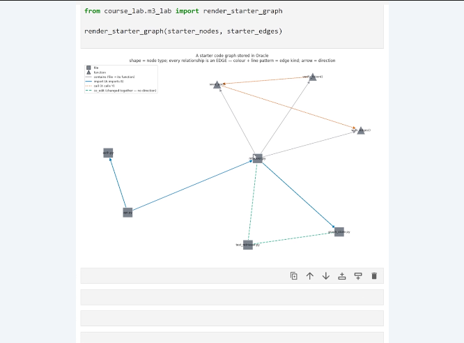
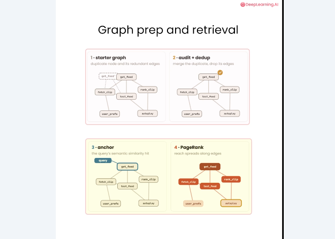
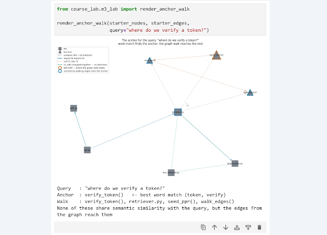
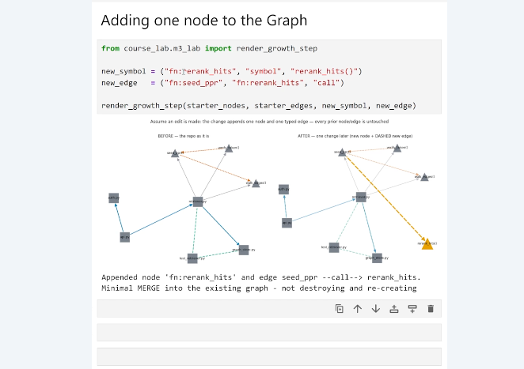
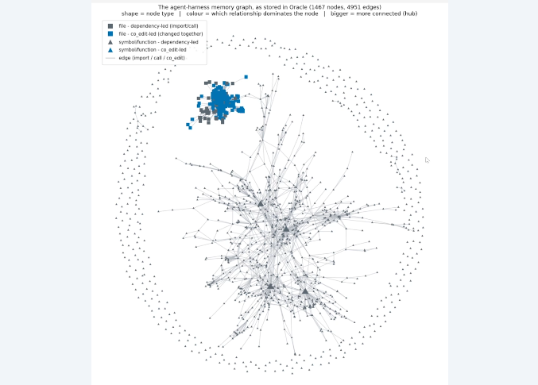
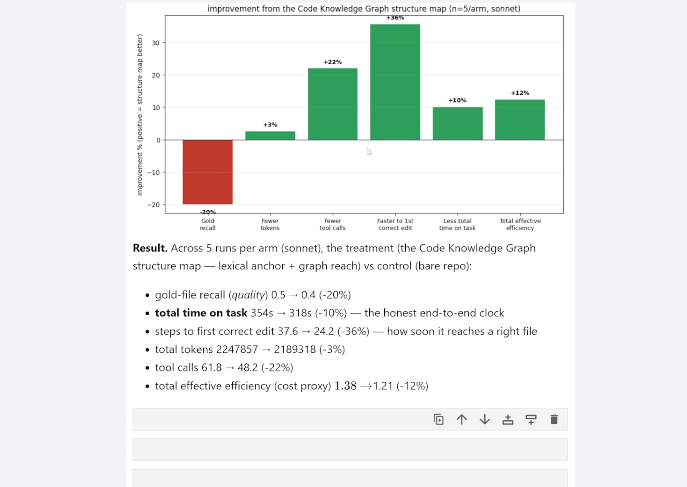
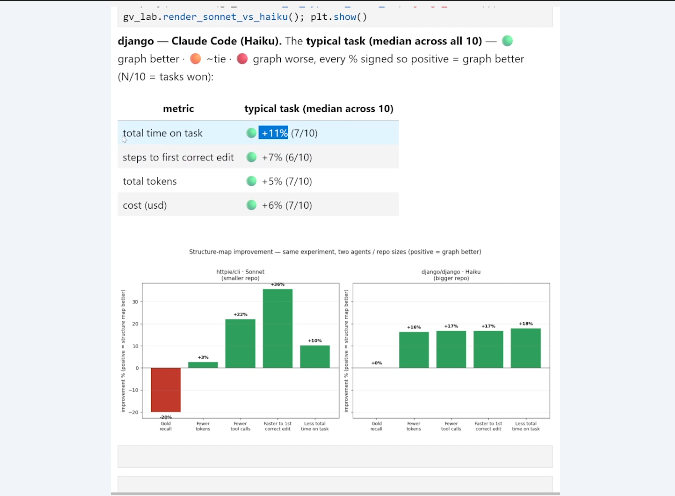
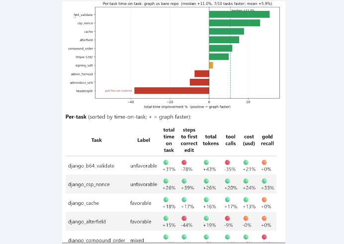

# 4. Construire et interroger un Code Knowledge Graph

Ce chapitre détaille le passage d’un dépôt source à un graphe exploitable par un agent. La construction sépare l’extraction des relations, le stockage, le nettoyage et le retrieval.

## Objectifs du chapitre

- modéliser les nœuds et relations d’un graphe de code ;
- comprendre l’extraction par AST et historique Git ;
- suivre un retrieval à partir d’un anchor ;
- interpréter les coûts d’ajout et les benchmarks du cours.

## Construire les nœuds et les relations

Chaque fichier ou fonction devient un **node**. Une **edge** relie une source à une destination et porte un type ainsi qu’une direction lorsque la relation l’exige :

```text
import  : file     → file
call    : function → function
co-edit : file     ↔ file
```

Les imports et calls sont détectés en analysant la structure du code avec un AST. Le co-edit est dérivé des fichiers apparaissant ensemble dans les changements Git. Cette extraction déterministe évite de demander au LLM de deviner les dépendances.



## Property graph et stockage

Un stockage de type property graph sépare généralement les tables de nodes et d’edges. Un node peut porter un chemin, un nom et une catégorie (`file` ou `function`). Une edge conserve sa source, sa destination, son type et éventuellement des propriétés comme un poids ou une fréquence.

Cette séparation permet d’ajouter une relation sans recopier le code source. Elle facilite aussi les audits : on peut vérifier les doublons, les edges sans destination et les nodes isolés avant d’exécuter le retrieval.

## Visualiser le graphe

Dans les visualisations du cours :

- les carrés représentent des fichiers ;
- les triangles représentent des fonctions ;
- les couleurs et styles de lignes distinguent les relations ;
- les flèches indiquent la direction lorsque la relation est dirigée.

La visualisation rend visibles les hubs, les composants périphériques et les chemins entre un fichier et ses dépendances.



## Préparer le retrieval

Avant de répondre à une requête, le système part d’un **starter graph**, l’audite et effectue une deduplication. Les doublons ou relations redondantes peuvent fausser les scores et gonfler le contexte.

La requête est ensuite rapprochée sémantiquement des nodes. Le node retenu devient l’**anchor**. PageRank ou une procédure équivalente propage alors la pertinence sur les edges afin de produire une liste à examiner.



## Parcourir le graphe à partir d’une requête

Pour la question « Where do we verify a token? », le node `verify_token()` constitue un anchor naturel. Le traversal suit ensuite des relations vers `retriever.py`, `seed_ppr()`, `walk_edges()` et d’autres éléments connectés.

Ces nodes n’ont pas forcément une similarité lexicale directe avec la question. Ils sont retrouvés parce qu’ils se situent sur des chemins structurels pertinents. Un **hop** est un déplacement d’un node vers un voisin ; une question multi-hop nécessite plusieurs déplacements avant d’atteindre le fichier utile.



## Ajouter un nouveau nœud

Quand une nouvelle fonction `rerank_hits` est introduite, elle peut être ajoutée au graphe avec une edge `call` depuis `seed_ppr`. L’opération est un **append** : elle ajoute les informations au graphe existant. Un `MERGE` intègre ensuite ces données dans la structure déjà stockée.

Le coût d’insertion est faible comparé à une reconstruction complète. Cette propriété rend réaliste une mise à jour après chaque changement important du projet.



## Passer à une vraie codebase

Dans l’exemple du cours, une base de code contient environ **208 fichiers**, **1 200 symboles** et **plus de 5 000 edges**. Un **symbole** est un élément identifiable comme une fonction, une classe ou une méthode. Une fonction **atomic** n’appelle pas d’autres fonctions et reste souvent en périphérie.

Un **hub** est une zone très dense. Le **degree** d’un node est son nombre de connexions. Les fichiers à haut degré sont des points centraux : une modification y a potentiellement des conséquences sur plusieurs sous-systèmes.



## Déduplication

Les doublons peuvent représenter deux fois le même fichier, une fonction sous des noms équivalents ou des fragments presque identiques. Ils ajoutent des edges artificielles et rendent le ranking moins lisible. Un audit doit donc repérer les clusters similaires, décider ce qui constitue une identité et fusionner les nodes sans perdre leurs propriétés.

## Tests lexicaux et questions multi-hop

Une question locale et lexicale peut être correctement traitée par une keyword search. Une question multi-hop demande au contraire de relier plusieurs indices : nom d’une fonction, import indirect, appel d’un helper et fichier de test co-édité.

Le graph retrieval n’est pas toujours meilleur. Il apporte surtout une structure lorsque la réponse se trouve plusieurs hops plus loin ou lorsque les fichiers pertinents ne partagent pas le vocabulaire de la requête.

## Résultats expérimentaux

Les expériences doivent être lues séparément :

| Expérience | Effets observés dans le cours |
|---|---|
| Benchmark de graphe sur agent réel | Environ 3 % de tokens en moins, 22 % de tool calls en moins, 36 % de temps en moins jusqu’à la première modification correcte et 10 % de temps total en moins ; gold-file recall en baisse d’environ 20 % |
| Django avec Haiku, médianes sur 10 tâches | 11 % de temps en moins, 7 % d’étapes en moins jusqu’à la première modification correcte, 5 % de tokens en moins et 6 % de coût en moins ; avantage sur 7 tâches sur 10 pour le temps |
| Analyse par tâche | Résultats variables : certaines tâches sont favorables, d’autres défavorables ou mixtes |

Le **gold recall** mesure la capacité à retrouver les fichiers de référence considérés comme idéaux. Un gain de vitesse ne signifie donc pas nécessairement que tous les fichiers attendus ont été récupérés. Ces mesures sont des observations expérimentales, pas une promesse universelle.







## Limites

Un graphe peut améliorer la navigation tout en sélectionnant un voisinage incomplet. Sa qualité dépend de l’extraction AST, de l’historique Git, de la déduplication et du choix de l’anchor. Une question simple peut ne rien gagner, tandis qu’une tâche multi-hop bénéficie fortement des relations. Il faut donc mesurer le temps, les étapes, les tokens, le coût et le gold recall ensemble.

## À retenir

- Le graphe encode des nodes, des edges, leur type et leur direction.
- AST et historique Git fournissent des relations complémentaires.
- Un anchor lance le traversal ; PageRank aide à classer les nodes atteints.
- L’ajout incrémental évite de reconstruire toute la carte du code.
- Hubs, degrés et fonctions atomiques révèlent la topologie du projet.
- Les benchmarks montrent des gains moyens mais aussi des régressions selon les tâches.

[← Retour au README](../README.md)
