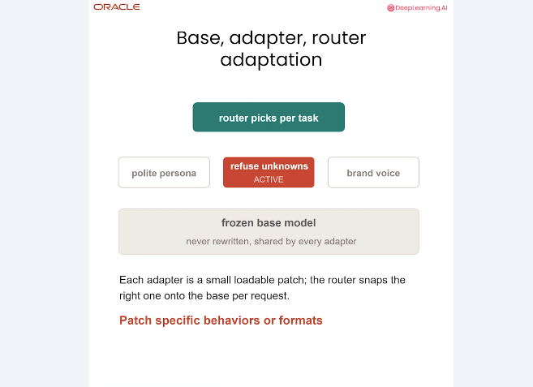
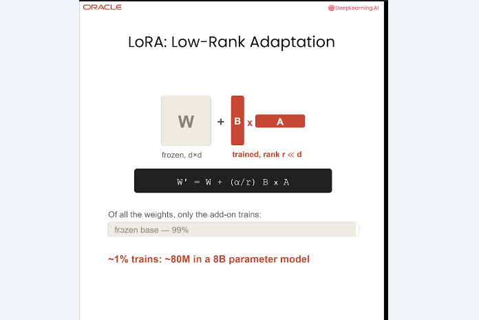
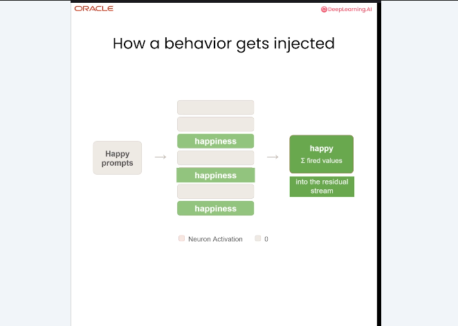
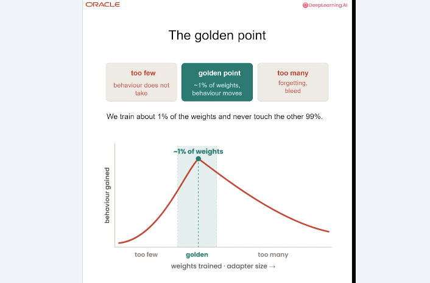
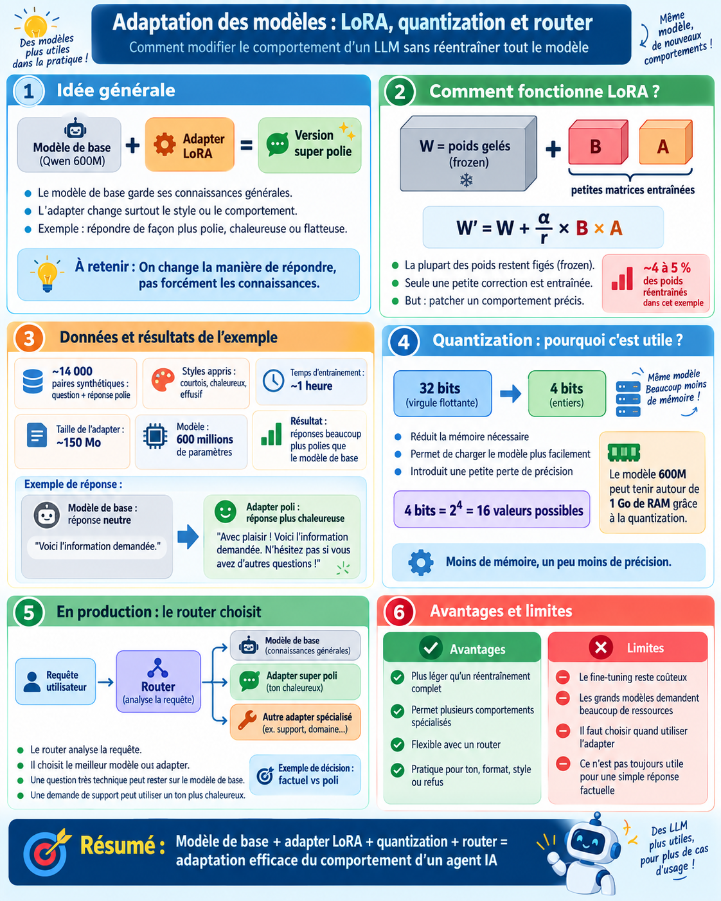
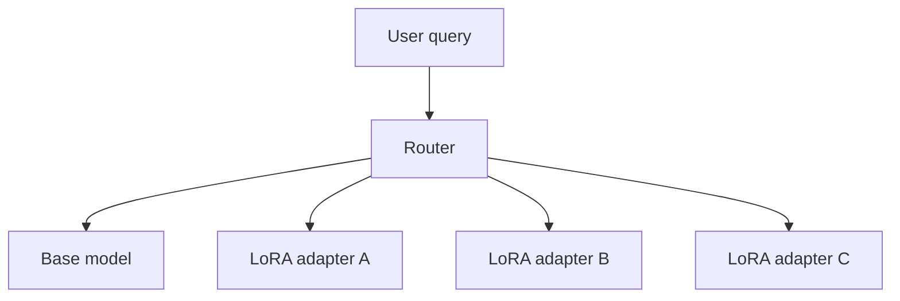

# 5. Weight-space adaptation : LoRA, quantization et router

Lorsque le contexte, la mémoire et le retrieval ne suffisent plus à obtenir le comportement voulu, l’adaptation peut passer dans le **weight space**. Cette étape est plus coûteuse et doit être justifiée par un besoin comportemental clair.

## Objectifs du chapitre

- distinguer token space et weight space ;
- comprendre le rôle des adapters et du router ;
- expliquer LoRA sans confondre adapter et poids de base ;
- relier capacité, quantization et coût d’entraînement.

## Passer du token space au weight space

Dans le token space, on modifie ce que le modèle reçoit : contexte, instructions, exemples, mémoire ou résultats de retrieval. Dans le weight space, on modifie les paramètres internes appris.

Le fine-tuning peut changer durablement le style ou la politique de réponse, mais demande davantage de mémoire, de calcul et de validation. Il existe aussi un risque de **catastrophic forgetting**, lorsque le nouvel entraînement dégrade des capacités déjà acquises. Le principe pratique est donc de commencer par les adaptations réversibles du contexte avant de toucher aux poids.

## Base model, adapters et router

Le **base model** est conservé gelé (*frozen*). Un **adapter** est un petit module entraîné pour modifier un comportement ciblé : persona polie, refus de certaines demandes ou voix de marque. Un **router** analyse la requête et choisit le modèle de base seul ou l’adapter approprié.

```text
requête utilisateur
        ↓
      router
   ┌────┼──────────────┐
base  adapter A     adapter B
model  ton poli      voix de marque
```

Cette architecture évite de stocker un modèle complet par comportement et permet d’activer un comportement spécialisé uniquement lorsque la requête le demande.



## LoRA : Low-Rank Adaptation

LoRA (*Low-Rank Adaptation*) garde les poids originaux gelés et apprend deux petites matrices supplémentaires :

```text
W' = W + (α / r) × B × A
```

- `W` : poids originaux, non modifiés ;
- `A` et `B` : matrices entraînables de l’adapter ;
- `r` : `rank`, dimension réduite de l’adaptation ;
- `α` : facteur d’échelle qui contrôle son intensité.

**Low-rank** signifie que la correction est représentée dans un espace de dimension plus petite que la matrice complète. LoRA n’entraîne donc pas forcément directement `W` : il apprend une correction compacte appliquée à côté du modèle de base.



## Comment un comportement est appris

On fournit des exemples montrant le comportement souhaité. Les entrées activent différents motifs internes ; l’adapter apprend une correction numérique associée à ces motifs. Dans l’explication pédagogique du cours, cette correction agit sur le **residual stream**, le flux interne qui transporte les représentations entre les couches.

Lors d’une nouvelle inférence, l’adapter peut rendre plus probable une réponse correspondant au style appris. Il ne s’agit pas d’une règle textuelle ajoutée au prompt, mais d’une modification des calculs internes. Cette description reste une intuition : elle explique le rôle de l’adapter sans prétendre localiser précisément un comportement dans un seul neurone ou une seule couche.



## Le golden point

Il faut assez de capacité pour apprendre le nouveau comportement, mais pas au point d’interférer avec le modèle général :

- trop peu de paramètres adaptés : le comportement apparaît à peine ;
- trop de paramètres modifiés : risque d’oubli catastrophique ;
- zone intermédiaire : compromis entre force du comportement et conservation des capacités.

Le cours utilise environ **1 %** comme repère conceptuel pour illustrer le golden point de LoRA. Dans l’expérience Qwen détaillée ensuite, environ **4 à 5 % des poids** sont concernés. Ces chiffres ne décrivent pas le même niveau de précision : le premier est un schéma de principe, le second un réglage expérimental particulier.



## Exemple Qwen « super polite »

L’expérience utilise un modèle Qwen d’environ **600 millions de paramètres**, environ **14 000 paires synthétiques** question-réponse et plusieurs styles : `courteous`, `warm` et `effusive`. L’adapter obtenu pèse environ **150 Mo** et l’entraînement prend environ **une heure** dans la configuration présentée. Environ **4 à 5 %** des poids sont concernés.

Le modèle conserve ses connaissances générales mais répond avec une formulation plus chaleureuse et flatteuse. L’objectif est donc principalement comportemental : le fine-tuning apprend une manière de répondre, pas une nouvelle base de connaissances générale.

## Quantization

La **quantization** réduit la précision numérique utilisée pour stocker les poids. Le cours illustre le passage d’une représentation floating point 32-bit à une représentation 4-bit :

```text
32 bits → 4 bits
4 bits  → 2⁴ = 16 niveaux possibles
```

Le modèle occupe beaucoup moins de mémoire, au prix d’une approximation. La **reconstruction error** est l’écart entre la valeur originale et la valeur reconstruite après quantification. Dans la configuration présentée, le modèle de 600 millions de paramètres tient autour de **1 Go de RAM**.

## Fine-tuning : coût et ressources

L’entraînement consomme mémoire, temps et puissance de calcul. Le petit entraînement Qwen prend environ une heure ; un modèle beaucoup plus grand demande davantage de GPU et peut nécessiter un fournisseur cloud. La `training loss` mesure l’écart entre les sorties attendues et les prédictions pendant l’apprentissage, mais une loss basse ne suffit pas à prouver que le comportement est sûr ou utile.

LoRA et la quantization réduisent le coût, sans le supprimer. Il reste nécessaire de tester le comportement, la conservation des capacités générales et les cas limites.

## Router en production

Un pipeline de production peut choisir l’adapter avec un routage simple, par exemple un appariement par expressions régulières :

```text
requête
  ├─ factuelle       → base model
  ├─ support chaud   → super polite adapter
  └─ autre comportement → adapter spécialisé
```

Le router doit être évalué sur les ambiguïtés et les erreurs de classification. Un mauvais routage peut appliquer une persona inadaptée ou contourner un comportement de refus attendu.

L’infographie de synthèse ci-dessous rassemble les trois leviers : adaptation par LoRA, réduction mémoire par quantization et sélection dynamique par router.



## Architecture globale



## À retenir

- Le weight space est un levier puissant mais plus coûteux et plus risqué que le token space.
- Les adapters spécialisent un modèle de base gelé.
- LoRA apprend une correction de faible rang avec `W' = W + (α / r) × B × A`.
- Le golden point équilibre capacité d’apprentissage et oubli catastrophique.
- L’exemple Qwen concerne un comportement de style, pas l’ajout de connaissances générales.
- Quantization réduit la mémoire en échange d’une perte de précision contrôlée.
- Un router permet d’activer le bon adapter selon la requête.

[← Retour au README](../README.md)
